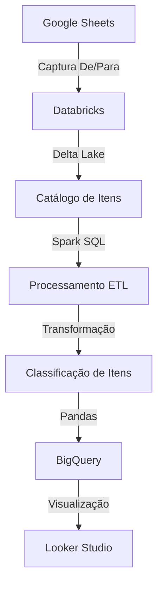

# **Pipeline de Controle de Estoque Comercial**


Pipeline ETL para controle de equipamentos alocados a colaboradores do setor comercial com integração de dados de RH.

## 📋 Visão Geral
O script é estruturado seguindo as etapas:
* Instalação de Depedências
* Integração com banco com o google Drive e captura de dados do DE/PARA de itens contido em planilha google sheets
* Encaminhamento para tabela DeltaLake Databricks
* Processamento em e SPARK/SQL para ETL dos dados
* Classificação dos itens do estoque com base em suas respectivas classes
* Integração com dados de RH
* Integração com o BigQuery para atualização do banco de dados
* Alimenta dashboard em Looker Studio 


## 🔄 Fluxo do Processo


## ⚙️ Pré-requisitos
- Python 3.8+
- Databricks Runtime
- Conta de serviço Google Cloud
- Acesso ao BigQuery

## 📁 Estrutura do código

## 🔧 Instalação

```bash
# No notebook Databricks:
%pip install google-auth google-auth-oauthlib google-auth-httplib2 google-api-python-client gspread drive pandas_gbq gspread_dataframe
unidecode numpy datetime packaging==23.2 -q

dbutils.library.restartPython()

```
**Finalidade das bibliotecas**
* Realiza as Autenticações Google/bigquery (OAuth2)
* Manipulação de planilhas (gspread)
* Integração BigQuery (pandas_gbq)
* Processamento de dados (Pandas/NumPy)
* Reinicialização do ambiente Python
  
## 🌐 Integração com Google Sheets

**1 - Instalação de dependências globais e autenticação**

```bash

SCOPES = ["https://www.googleapis.com/auth/spreadsheets", "https://www.googleapis.comauth/drive"]
SERVICE_ACCOUNT_FILE = '/Workspace/Users/.../gsa_dados_drive.json'
credentials = Credentials.from_service_account_file(SERVICE_ACCOUNT_FILE, scopes=SCOPES)
client = gspread.authorize(credentials)

```
* Os SCOPES definem as permissões de leitura/escrita que serão utilizadas para acessar o ambiente google
* Autenticação via conta de serviço do google drive para manioulação das planilhas
* Criação do cliente via objeto de credencial gerado pelo uso de arquivo JSON da conta de serviço.
  
**2 - Após a integração o código abaixo**

* Acessa a planilha pelo ID definido no parâmetro open_by_key
* Seleciona a aba específica
* Converte os dados para DataFrame Pandas

```bash
spreadsheet = client.open_by_key('ID_PLANILHA')
worksheet = spreadsheet.worksheet("nome_aba_planilha")
ss = pd.DataFrame(worksheet.get_all_records())
```
**3 - Encaminhamento da tabela para o Delta Lake Catalog/Databricks via spark**
```bash
spark.createDataFrame(ss).write.format("delta")
    .mode("overwrite")
    .saveAsTable("database.schema.depara_itens")
```
* Cria tabela Delta Lake versionada
* Estrutura: database.schema.table_name
* Modo overwrite para atualizações completas
  
## 🧑‍💻 ETL principal: processamento em SPARK/SQL

**1. CTE da base de estoque**
```bash
-- CTE 1 : Seleciona a base principal fato para itens no estoque por funcionários

WITH estoque_atual AS (
  SELECT 
      * 

  FROM 
      gdb_brisanet_controladoria.planejamento_controle_materiais.estoque_atual_por_localidade 
  WHERE localidade_tipo = 'Funcionário'


),

-- CTE 2 : Seleciona colunas específicas da tabela quando o item_id não for nulo

estoque AS (
    SELECT 
        item_id, 
        nome_item, 
        numero_serie, 
        nome_localidade, 
        data_movimento 
    FROM estoque_atual 
    WHERE item_id is not null),
```
* CTE 1 - Filtros aplicados: Restringe a equipamentos alocados a funcionários;
* CTE 2 - Filtros aplicados: Restringe equipamentos aos quais não possuem id nulo.
  
**2. ETL na base de Quadro Ativo**
```bash

-- CTE 3

ano_mes_quadro AS (
    SELECT ANO, MES 
    FROM gdb_brisanet_bi.folha_de_pagamento.quadro_ativo 
    ORDER BY ANO DESC, MES DESC 
    LIMIT 1
),

-- CTE 4
quadro_comercial AS (
    SELECT 
        MATRICULA, 
        NOME, 
        CPF, 
        CARGO,
        CIDADE_ESTABELECIMENTO,
        ESTADO_ESTABELECIMENTO,
        GERENCIA_FUNCIONAL,
        SETOR,
        DIRETORIA, 
        EMAIL,
        ANO,
        MES
    FROM 
        gdb_brisanet_bi.folha_de_pagamento.quadro_ativo
    WHERE 
        1 = 1
        AND ANO = (SELECT ANO FROM ano_mes_quadro)
        AND MES = (SELECT MES FROM ano_mes_quadro)
        AND DIRETORIA = 'COMERCIAL'
)
```
* CTE 3 - Captura o último mês/ano com dados de RH disponíveis;
* CTE 4 - Seleção do quadro ativo para o período mais recente.

**3. Junção de tabelas**

-- CTE 5 : Junção de dados

```bash
estoque_at AS (

    SELECT 
        *,
        -- Extrai a parte numérica do início da string nome_localidade e converte para BIGINT (CPF)
        CAST(REGEXP_REPLACE(SPLIT(nome_localidade, ' ')[0], '\\\\D', '') AS BIGINT) AS CPF_INT,

        -- Extrai o nome do colaborador (após o primeiro espaço), remove acentos e coloca em maiúsculo
        UPPER(
        TRANSLATE(
        SUBSTR(nome_localidade, POSITION(' ' IN nome_localidade) + 1),
        'ÁÀÂÃÄÉÈÊËÍÌÎÏÓÒÔÕÖÚÙÛÜÇÑáàâãäéèêëíìîïóòôõöúùûüçñ',
        'AAAAAEEEEIIIIOOOOOUUUUCNaaaaaeeeeiiiiooooouuuucn')) AS NOME_COLAB

    FROM estoque
),

-- CTE 6
 quadro_com_cpf_int AS (
     
    SELECT 
        MATRICULA,
        CAST(CPF AS BIGINT) AS CPF_INTEIRO,
        EMAIL,
        CARGO,
        CIDADE_ESTABELECIMENTO AS CIDADE,
        ESTADO_ESTABELECIMENTO AS UF,
        SETOR,
        GERENCIA_FUNCIONAL

    FROM quadro_comercial
),

-- CTE 7
 base AS (
     
    SELECT 
        item_id,
        nome_item,
        numero_serie,
        nome_localidade,
        data_movimento,
        CPF_INT,
        NOME_COLAB,
        MATRICULA,
        EMAIL,
        CARGO,
        CIDADE,
        UF,
        SETOR,
        GERENCIA_FUNCIONAL

    FROM estoque_at
    LEFT JOIN quadro_com_cpf_int
    ON estoque_at.CPF_INT = quadro_com_cpf_int.CPF_INTEIRO
 )
```
* CTE 5 - Extrai CPF do início da string nome_localidade
* CTE 5 - Normaliza nomes (uppercase, remove acentos)
* CTE 5 - Separa a coluna nome_localidade e extrai o CPF e o nome localidade em coluna diferentes
* CTE 6 - Seleciona as colunas necessárias da tabela quadro
* CTE 7 - Vincula via leftjoin as informações de quadro com o banco principal de itens em estoque

## **4. Classificação de Itens** (EM DEV)
