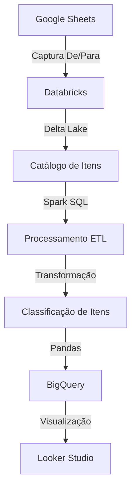

# **Pipeline de Controle de Estoque Comercial**


Pipeline ETL para controle de equipamentos alocados a colaboradores do setor comercial com integração de dados de RH.

## 📋 Visão Geral
O script é estruturado seguindo as etapas:
* Instalação de Depedências
* Integração com banco com o google Drive e captura de dados do DE/PARA de itens contido em planilha google sheets
* Encaminhamento para tabela DeltaLake Databricks
* Processamento em e SPARK/SQL para ETL dos dados
* Classificação dos itens do estoque com base em suas respectivas classes
* Integração com dados de RH
* Integração com o BigQuery para atualização do banco de dados
* Alimenta dashboard em Looker Studio 


## 🔄 Fluxo do Processo


## ⚙️ Pré-requisitos
- Python 3.8+
- Databricks Runtime
- Conta de serviço Google Cloud
- Acesso ao BigQuery

## 📁 Estrutura do código

## 🔧 Instalação

```bash
# No notebook Databricks:
%pip install google-auth google-auth-oauthlib google-auth-httplib2 google-api-python-client gspread drive pandas_gbq gspread_dataframe
unidecode numpy datetime packaging==23.2 -q

dbutils.library.restartPython()

```
## ⌛ Em DEV
